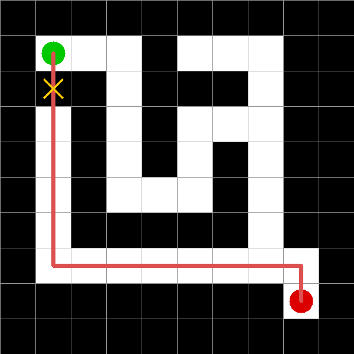

# AIPI Project 2 · Visual Maze-Solving Agent

**Two architectures · Two failure modes**

Dohoon Kim · Duke University · AIPI

---

## Overview

This project builds the **same agent twice**. One version uses classical methods (OpenCV and BFS), the other uses deep learning (Claude Vision and Behavior Cloning). The central finding is that the two systems are brittle in fundamentally different ways, and that difference illustrates why production autonomous systems are hybrid.

| | Non-DL | DL |
|---|---|---|
| Perception | OpenCV center-pixel sampling | Claude Vision API (zero-shot VLM) |
| Planning | BFS (from Assignment 1, reused) | Behavior-cloned MLP on BFS trajectories |
| Control | Action-sequence execution and legality check | Same |

---

## The punchline



On a **clean input** where the classical agent succeeds 100% of the time, the DL agent fails about 60% of the time. Why? VLM perception is about 92% accurate per cell, close but never perfect, and the planner computes an optimal path on its *perceived* grid. One misclassified wall cell (yellow ✕) creates a phantom corridor. In the real environment, the trajectory walks through a wall. The legality check rejects it.

This is **cascade failure**, the characteristic failure mode of modular pipelines. A 92% perception layer driving a 20-cell plan has theoretical success probability of 0.92²⁰ ≈ 19%. The project observed 40%, which is actually better than the bound because BFS tends to route through interior cells where perception is more reliable.

---

## Evaluation results

20 mazes across 4 perturbation categories (5 each).

| Condition | Non-DL success | DL success | Observation |
|-----------|---------------:|-----------:|-------------|
| Clean | **100%** | 40% | DL loses despite perception being about 92% |
| Noisy (pixel noise) | **100%** | 40% | Pixel sampler's thresholds are surprisingly tolerant |
| Dim (brightness 0.5) | **100%** | 20% | Same pattern |
| Rotated (10°) | 0% | 0% | Both collapse, geometric invariance is hard |

Two different failure modes reveal two different fragilities.

- **Classical fails binary.** Works perfectly, or fails catastrophically.
- **DL fails in cascade.** Small perception errors propagate into planning failures.

Neither is universally better. The right choice depends on expected input variance and whether downstream validation exists.

---

## Repository structure

```
AIPI-Project2-MazeAgent/
├── README.md
├── Dohoon_Kim_Project2.ipynb
├── Dohoon_Kim_Project2_Slides.pptx
├── images/
│   ├── demo_clean.png
│   ├── demo_cascade.png
│   └── demo_rotated.png
├── eval_results.csv
└── .gitignore
```

Flat structure by design. All core logic lives in the single notebook, matching the Assignment 2 and Assignment 3 submission pattern.

---

## How to run

### Prerequisites
- Google Colab (GPU runtime recommended, T4 is enough)
- An Anthropic API key

### Steps

1. **Open** `Dohoon_Kim_Project2.ipynb` in Colab.
2. **Enable GPU** via Runtime → Change runtime type → T4 GPU.
3. **Add API key** to Colab Secrets (key icon on the left panel) as `ANTHROPIC_API_KEY`.
4. **Run all cells** top to bottom (about 5 to 10 minutes total).
   - Part 1, maze generator (instant)
   - Parts 2.x, Non-DL agent (instant)
   - Part 3.1, DL perception sanity check (1 API call)
   - Part 3.2, Behavior cloning training (about 1 to 2 minutes on T4)
   - Part 4.2, full evaluation (about 1 to 2 minutes, roughly 20 API calls)
   - Part 5, pre-executed demos (instant)

### Approximate API cost
Full evaluation makes about 25 Claude Vision API calls. At current Sonnet 4.5 pricing (around $3 per 1M input tokens), total cost is **under $1**.

---

## Architecture decisions (why-not questions)

### Why Claude Vision instead of a custom CNN?
A custom CNN would need patch-dataset curation, augmentation, and training time. A frontier VLM solves the task zero-shot. The trade-off was explicit. Training complexity was swapped for API latency and cost.

*In hindsight, the VLM's 92% accuracy wasn't quite "good enough" to drive a deterministic planner. See the cascade failure section above.*

### Why Behavior Cloning instead of DQN?
DQN requires reward shaping, a replay buffer, and careful stability tuning. Behavior cloning reduces to supervised learning on optimal BFS trajectories, with no reward design, no exploration, and no instability. The trade-off is that the policy only generalizes to states seen during training.

### Why not a validation layer between perception and planning?
One minimal validator is included (auto-flip for inverted 0/1 encoding, based on the border-should-be-walls invariant). A full production system would add connectivity checks, per-cell confidence thresholding with re-query, and structured output enforcement. These are listed in the Redesign section of the notebook's Lessons Learned.

---

## Lessons learned (short form)

1. **Two fragilities.** Classical fails binary; DL fails in cascade. Different failure modes demand different mitigations.
2. **Accuracy is not end-to-end success.** In modular pipelines, success is multiplicative across stages. A 92% perception layer can drop effective system performance by 60%, not 8%.
3. **Hybrid wins in practice.** Production autonomous systems use DL perception, classical planning, and validation layers. Not because it's trendy, but because cascade failure is a known failure mode.

Full discussion lives in the notebook's Part 6 markdown cell.

---

## Tech stack

- **Python 3.11** (Colab default)
- **NumPy, OpenCV, PyTorch, Pandas, matplotlib** for the standard scientific stack
- **httpx** for direct HTTP calls to the Anthropic API (no SDK framework, same pattern as Assignment 3)
- **Anthropic Claude Sonnet 4.5** via the Claude Vision API

No additional heavy dependencies. No frameworks (no LangChain, no Gym, no RL library).

---

## Notes on reproducibility

- All random seeds are fixed (`SEED = 42`).
- The maze generator is deterministic for a given seed.
- Behavior cloning training converges consistently to at least 95% training accuracy.
- VLM calls are non-deterministic by nature. Occasional perception errors differ run-to-run, but the aggregate evaluation pattern is stable.

---

## If this notebook doesn't render on GitHub

GitHub can refuse to render notebooks with a `metadata.widgets` block. If that happens, either open in Colab directly or strip widget metadata with this command.

```bash
jupyter nbconvert --to notebook --ClearMetadataPreprocessor.enabled=True \
  --ClearMetadataPreprocessor.clear_notebook_metadata=False \
  Dohoon_Kim_Project2.ipynb --output Dohoon_Kim_Project2.ipynb
```

---

## Submission checklist

- [ ] Notebook runs top-to-bottom without errors (tested in fresh Colab runtime)
- [ ] `ANTHROPIC_API_KEY` instruction is clear for graders
- [ ] GitHub repo is public or shared with graders
- [ ] 10-minute video recorded and uploaded to Canvas
- [ ] `eval_results.csv` present at repo root (regenerated on latest run)
- [ ] README renders correctly on GitHub (images load)

---

## Acknowledgments

- BFS planner and STRIPS action formulation carried over from Assignment 1.
- API integration pattern (direct `httpx` calls, no SDK) carried over from Assignment 3.
- Course structure and evaluation criteria from AIPI at Duke Pratt School of Engineering.
